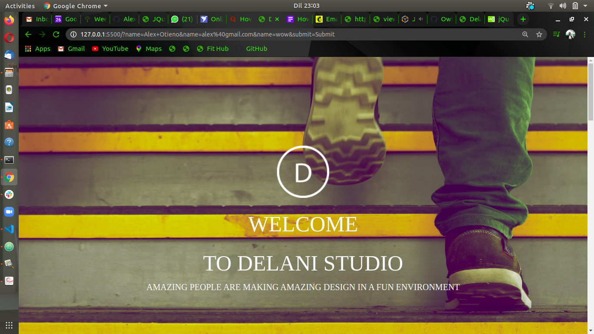

### Delani Studio

### Author
* Alex Otieno

### Description
* This is a web application for delani studio that shows informatio about delani and the project they have been doing and also it allows users to send message about delani studio website.

### Screenshot

### Live Demo

### Installation / Setup instruction
* Open your terminal
* git clone https://github.com/Alexotieno1717/delani-studio.git
* cd delani-studio
* code . (Open in vscode)
* Atom .

### Technologies Used
* HTML
* CSS
* JavaScript
* Bootstrap
* Markdown

### BDD
#### Input
* insert your name, email address and message

#### Output
* An alert We have receive your message thank you for contacting us.

### Known Bugs
* The site is not responsive in some devices.
* The Function did not work as expected.
* Mailchip does not function properly.

### Contact
Incase of any question or you want to contribute please contact me at alexotieno900@gmail.com

### License
* MIT license
* Copyright &copy; 2020 Alex Otieno